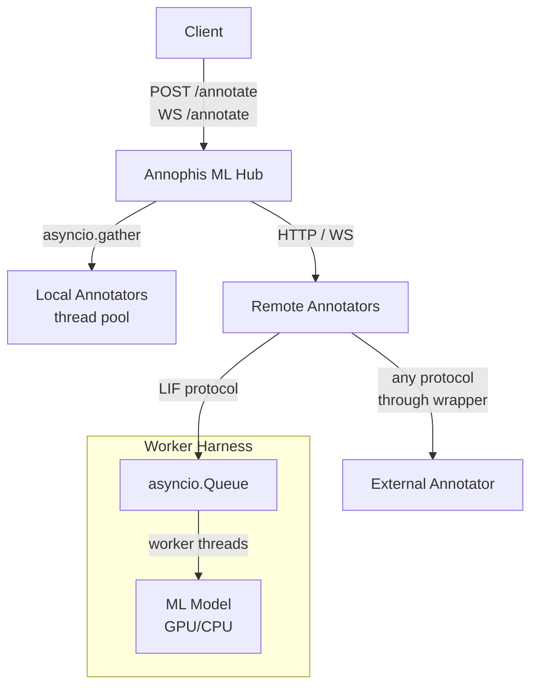

# Annophis ML Hub

A text annotation hub — submit text as a [LAPPS Interchange Format (LIF)](https://wiki.lappsgrid.org/interchange/) document, get annotations back from one or more annotators (NER, POS, or anything else).

Annophis ML Hub acts as a proxy for multiple Machine Learning models: it accepts LIF annotation requests, runs them through a sequential pipeline of configured annotators, and returns the enriched LIF document. Annotators can run in-process (local) or as separate services (remote). Contract validation ensures each annotator's input requirements (language, prior annotations, features) are met before it runs.

## Architecture



**Hub** (`annophis_mlhub/`) — FastAPI app. Loads annotators from `mlhub.toml` at startup and routes requests through them as a pipeline.

**Local annotators** — run in the hub process. Blocking work is offloaded with `asyncio.to_thread`; an `asyncio.Semaphore` limits concurrency (default: 1, i.e. serialised).

**Remote annotators** — the hub proxies to external HTTP or WebSocket APIs. The `RemoteAnnotator` base class handles the HTTP client lifecycle; subclasses translate between the external API's schema and LIF annotations. `GenericRemoteAnnotator` wraps services that already speak the LIF protocol (e.g. worker harness instances), while other subclasses can adapt entirely different APIs (e.g. `HuggingFaceAnnotator` translates the HF Inference API's response format).

**Worker harness** (`annophis_mlhub/worker/`) — a thin FastAPI wrapper that makes any ML model speak the LIF protocol, making it a drop-in remote annotator. An internal `asyncio.Queue` serialises inference through a single persistent background thread, which is safe for GPU models.

## API

All annotation endpoints use the [LAPPS Interchange Format (LIF)](https://wiki.lappsgrid.org/interchange/) — a JSON-LD standard for NLP annotation interchange. Documents carry their text, metadata, and annotation views in a single JSON-LD structure.

### REST

**`POST /annotate`**

Request:

```json
{
  "document": {
    "@context": "http://vocab.lappsgrid.org/context-1.0.0.jsonld",
    "text": { "@value": "Athens is the capital of Greece." }
  },
  "annotators": ["my-ner"]
}
```

Response (the input document enriched with a view containing annotations):

```json
{
  "@context": [
    "http://vocab.lappsgrid.org/context-1.0.0.jsonld",
    { "lexvo": "http://lexvo.org/id/iso639-3/" }
  ],
  "text": { "@value": "Athens is the capital of Greece." },
  "views": [
    {
      "id": "v0",
      "metadata": {
        "contains": {
          "NamedEntity": { "producer": "my-ner", "type": "NamedEntity" }
        }
      },
      "annotations": [
        {
          "@type": "NamedEntity",
          "id": "ne0",
          "start": 0,
          "end": 6,
          "features": { "category": "LOC", "word": "Athens" }
        },
        {
          "@type": "NamedEntity",
          "id": "ne1",
          "start": 25,
          "end": 31,
          "features": { "category": "LOC", "word": "Greece" }
        }
      ]
    }
  ]
}
```

Annotators run sequentially as a pipeline — each one receives the document enriched by the previous annotators, enabling chaining (e.g. sentence splitting → POS tagging).

**`GET /annotators`** — JSON-LD document listing all registered annotators and their contracts:

```json
{
  "@context": [
    "http://localhost:8000/vocab",
    {
      "annophis_mlhub": "http://vocab.annophis_mlhub.org/",
      "rdfs": "...",
      "lapps": "...",
      "dcterms": "...",
      "lexvo": "..."
    }
  ],
  "@graph": [
    {
      "@type": "annophis_mlhub:Annotator",
      "rdfs:label": "my-ner",
      "dcterms:description": "My NER model",
      "annophis_mlhub:producesAnnotation": [{ "@id": "lapps:NamedEntity" }]
    }
  ]
}
```

**`GET /annotators/{name}`** — JSON-LD descriptor for a single annotator.

**`GET /vocab`** — the annophis_mlhub OWL vocabulary (JSON-LD), defining the `Annotator` class and contract properties.

**`GET /health`** — health check.

**`GET /docs`** — interactive API docs (Scalar UI). The full OpenAPI schema is also available at `/openapi.json`.

### WebSocket

**`WS /annotate?annotators=name1&annotators=name2`**

Send `WsInputUnit` messages; receive `WsOutputUnit` messages as each annotator completes. Results stream back individually rather than waiting for all annotators to finish.

```json
// send
{ "id": "unit-1", "document": { "@context": "http://vocab.lappsgrid.org/context-1.0.0.jsonld", "text": { "@value": "Athens is the capital of Greece." } } }

// receive (one per annotator, as they complete)
{ "id": "unit-1", "annotator": "my-ner", "annotations": [{ "@type": "NamedEntity", "id": "ne0", "start": 0, "end": 6, "features": { "category": "LOC", "word": "Athens" } }] }
```

Omit the `annotators` query parameter to target all registered annotators.

## LIF contract validation

Each annotator declares a **contract** describing what it requires and what it produces, using [LAPPS vocabulary](http://vocab.lappsgrid.org/) URIs:

| Field                 | Description                                    | Example                 |
| --------------------- | ---------------------------------------------- | ----------------------- |
| `requires_language`   | Language the input text must be in (lexvo URI) | `"lexvo:grc"`           |
| `requires_annotation` | Annotation types that must already be present  | `["lapps:Sentence"]`    |
| `requires_feature`    | Features that must exist on prior annotations  | `["lapps:Token#pos"]`   |
| `produces_annotation` | Annotation types this annotator adds           | `["lapps:NamedEntity"]` |
| `produces_feature`    | Features this annotator populates              | `["lapps:Token#pos"]`   |

Before running an annotator, the hub validates its contract against the current state of the LIF document. CURIEs (e.g. `lapps:Sentence`) are expanded to full URIs using [pyld](https://github.com/digitalbazaar/pyld) for spec-compliant JSON-LD processing. If requirements are not met, the request fails with a 422 error listing the violations.

This enables **pipeline chaining** — for example, a sentence counter that `requires_annotation = ["lapps:Sentence"]` will only run if a sentence splitter has already added sentence annotations to the document's view.

## Configuration

Annotators are declared in `mlhub.toml`:

```toml
# Local annotator (runs in-process)
[[annotator]]
name = "my-ner"
annotation_type = "ner"
class_path = "my_package.MyNerAnnotator"
produces_annotation = ["lapps:NamedEntity"]

# Remote annotator (proxies to an external service)
[[annotator]]
name = "remote-pos"
annotation_type = "pos"
class_path = "annophis_mlhub.annotators.remote.GenericRemoteAnnotator"
base_url = "http://localhost:8001"
description = "My POS model"
requires_language = "lexvo:grc"
requires_annotation = ["lapps:Sentence"]
produces_annotation = ["lapps:Token"]
produces_feature = ["lapps:Token#pos"]
```

All extra fields are forwarded as keyword arguments to the annotator constructor.

Server settings via environment variables:

| Variable        | Default     |
| --------------- | ----------- |
| `ANNOHUB_HOST`  | `127.0.0.1` |
| `ANNOHUB_PORT`  | `8000`      |
| `ANNOHUB_DEBUG` | `false`     |

## Adding an annotator

### Local annotator

Subclass `LocalAnnotator` and implement `annotate_sync()`:

```python
from annophis_mlhub.annotators.local import LocalAnnotator
from annophis_mlhub.lif import LIFAnnotation, LIFDocument

class MyNerAnnotator(LocalAnnotator):
    def annotate_sync(self, doc: LIFDocument) -> list[LIFAnnotation]:
        text = doc.text.value
        # your inference here — return LIF annotations
        return [
            LIFAnnotation(
                id="ne0",
                type="NamedEntity",
                start=0,
                end=6,
                features={"category": "LOC", "word": text[0:6]},
            )
        ]
```

Add to `mlhub.toml`:

```toml
[[annotator]]
name = "my-ner"
annotation_type = "ner"
class_path = "my_package.MyNerAnnotator"
produces_annotation = ["lapps:NamedEntity"]
```

### Remote annotator

For any external API, subclass `RemoteAnnotator` and implement `annotate()` and `info()`. The subclass is responsible for translating between the external API's schema and `LIFAnnotation` objects. See `HuggingFaceAnnotator` for a real example that adapts the HF Inference API.

**`GenericRemoteAnnotator`** is a ready-made subclass for services that already speak the LIF protocol (i.e. a worker harness). No code needed — configure it entirely from TOML:

```toml
[[annotator]]
name = "remote-ner"
annotation_type = "ner"
class_path = "annophis_mlhub.annotators.remote.GenericRemoteAnnotator"
base_url = "http://localhost:8001"
```

The remote service must expose `POST /annotate` accepting a LIF document and returning `{"annotations": [...]}`.

### Worker harness (wrapping an ML model)

Use the worker harness to turn any ML model into a valid remote annotator:

```python
from annophis_mlhub.worker import ModelWorker
from annophis_mlhub.lif import LIFAnnotation

class MyModel(ModelWorker):
    name = "my-ner"
    annotation_type = "ner"
    description = "My custom NER model"

    def load(self) -> None:
        self.model = ...  # load weights once at startup

    def predict(self, text: str) -> list[LIFAnnotation]:
        # synchronous inference; runs in a background thread
        return [
            LIFAnnotation(
                id="ne0",
                type="NamedEntity",
                start=0,
                end=6,
                features={"category": "LOC", "word": text[0:6]},
            )
        ]
```

Run the worker service:

```sh
python -m annophis_mlhub.worker serve my_module:MyModel \
    --name my-ner --annotation-type ner --port 8001
```

The harness exposes `/annotate`, `/health`, and `/info` endpoints (all returning JSON-LD) and serialises inference through a single worker thread (safe for GPU models).

## Running

The project uses [https://docs.astral.sh/uv](`uv`) for managing the python dependencies in a dedicated `venv`.

```sh
uv run main.py
```

## Testing

```sh
uv run -m pytest tests/ -v
```

Tests use a nonexistent config path by default so no annotators are loaded. Use the `_use_real_config` fixture to test against `mlhub.toml`.

## Stack

- **FastAPI** — API framework, OpenAPI compatible
- **Scalar** — interactive API docs at `/docs`
- **Pydantic / pydantic-settings** — validation and config
- **pyld** — JSON-LD processing and CURIE expansion
- **httpx** — async HTTP client for remote annotators
- **uvicorn** — ASGI server
- **Python 3.14**

## Credits

Development by [Ghent Centre for Digital Humanities - Ghent University](https://www.ghentcdh.ugent.be/). Funded by the [FWO research infrastructure project ANNOPHIS](https://www.ghentcdh.ugent.be/projects).


