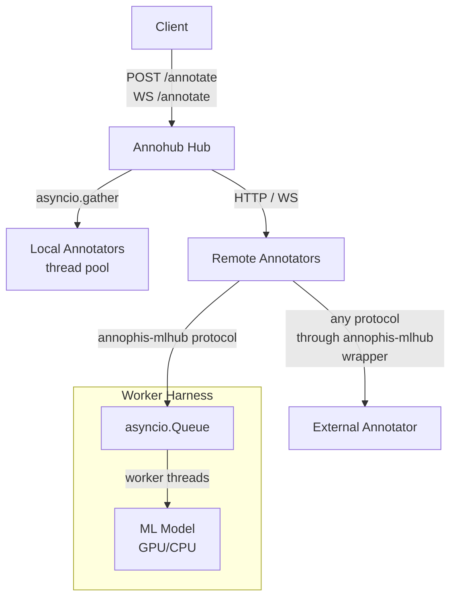

# Annohub

A text annotation proxy — submit text, get spans back from one or more annotators (NER, POS, or anything else).

Annohub acts as a hub: it accepts annotation requests, fans them out to the configured annotators concurrently, and returns the combined results. Annotators can run in-process (local) or as separate services (remote).

## Architecture



**Hub** (`annophis_mlhub/`) — FastAPI app. Loads annotators from `mlhub.toml` at startup and routes requests to them.

**Local annotators** — run in the hub process. Blocking work is offloaded with `asyncio.to_thread`; an `asyncio.Semaphore` limits concurrency (default: 1, i.e. serialised).

**Remote annotators** — the hub proxies to external HTTP or WebSocket APIs. The `RemoteAnnotator` base class handles the HTTP client lifecycle; subclasses translate between the external API's schema and annophis-mlhub's internal models. This can be any API — `GenericRemoteAnnotator` wraps services that already speak the annophis-mlhub protocol (e.g. worker harness instances), while other subclasses can adapt entirely different APIs (e.g. `HuggingFaceAnnotator` translates the HF Inference API's response format).

**Worker harness** (`annophis_mlhub/worker/`) — a thin FastAPI wrapper that makes any ML model speak the annophis-mlhub protocol, making it a drop-in remote annotator. An internal `asyncio.Queue` serialises inference through a single persistent background thread, which is safe for GPU models.

## API

### REST

**`POST /annotate`**

Request:

```json
{
  "text": "Athens is the capital of Greece.",
  "annotators": ["my-ner", "my-pos"]
}
```

Response:

```json
{
  "text": "Athens is the capital of Greece.",
  "annotations": [
    {
      "annotator": "my-ner",
      "annotation_type": "ner",
      "spans": [
        { "start": 0, "end": 6, "label": "LOC", "text": "Athens" },
        { "start": 25, "end": 31, "label": "LOC", "text": "Greece" }
      ]
    }
  ]
}
```

**`GET /annotators`** — list all registered annotators and their availability.

**`GET /health`** — health check.

**`GET /docs`** — interactive API docs (Scalar UI). The full OpenAPI schema is also available at `/openapi.json`, compatible with any OpenAPI tooling.

### WebSocket

**`WS /annotate?annotators=name1&annotators=name2`**

Send `WsInputUnit` messages; receive `WsOutputUnit` messages as each annotator completes. Results stream back individually rather than waiting for all annotators to finish.

```json
// send
{ "id": "unit-1", "text": "Athens is the capital of Greece." }

// receive (one per annotator, as they complete)
{ "id": "unit-1", "annotator": "my-ner", "annotation_type": "ner", "spans": [...] }
```

Omit the `annotators` query parameter to target all registered annotators.

## Configuration

Annotators are declared in `mlhub.toml`:

```toml
# Local annotator (runs in-process)
[[annotator]]
name = "my-ner"
annotation_type = "ner"
class_path = "my_package.MyNerAnnotator"

# Remote annotator (proxies to an external service)
[[annotator]]
name = "remote-pos"
annotation_type = "pos"
class_path = "annophis_mlhub.annotators.remote.GenericRemoteAnnotator"
base_url = "http://localhost:8001"
description = "My POS model"
```

All extra fields are forwarded as keyword arguments to the annotator constructor.

Server settings via environment variables:

| Variable        | Default     |
| --------------- | ----------- |
| `ANNOHUB_HOST`  | `127.0.0.1` |
| `ANNOHUB_PORT`  | `8000`      |
| `ANNOHUB_DEBUG` | `false`     |

## Adding an annotator

### Local annotator

Subclass `LocalAnnotator` and implement `annotate_sync()`:

```python
from annophis_mlhub.annotators.local import LocalAnnotator
from annophis_mlhub.models import AnnotationRequest, AnnotationResult, Span

class MyNerAnnotator(LocalAnnotator):
    def __init__(self, **kwargs):
        super().__init__(name="my-ner", annotation_type="ner")
        self.description = "My NER model"

    def annotate_sync(self, request: AnnotationRequest) -> AnnotationResult:
        spans = [...]  # your inference here
        return AnnotationResult(
            annotator=self.name,
            annotation_type=self.annotation_type,
            spans=spans,
        )
```

Add to `mlhub.toml`:

```toml
[[annotator]]
name = "my-ner"
annotation_type = "ner"
class_path = "my_package.MyNerAnnotator"
```

### Remote annotator

For any external API, subclass `RemoteAnnotator` and implement `annotate()` and `info()`. The subclass is responsible for translating between the external API's schema and annophis-mlhub's `AnnotationResult` / `AnnotatorInfo` models. See `HuggingFaceAnnotator` for a real example that adapts the HF Inference API.

**`GenericRemoteAnnotator`** is a ready-made subclass for services that already speak the annophis-mlhub protocol (i.e. a worker harness). No code needed — configure it entirely from TOML:

```toml
[[annotator]]
name = "remote-ner"
annotation_type = "ner"
class_path = "annophis_mlhub.annotators.remote.GenericRemoteAnnotator"
base_url = "http://localhost:8001"
```

The remote service must expose `POST /annotate` accepting `{"text": "..."}` and returning `{"annotator": "...", "annotation_type": "...", "spans": [...]}`.

### Worker harness (wrapping an ML model)

Use the worker harness to turn any ML model into a valid remote annotator:

```python
from annophis_mlhub.worker import ModelWorker, Span

class MyModel(ModelWorker):
    name = "my-ner"
    annotation_type = "ner"
    description = "My custom NER model"

    def load(self) -> None:
        self.model = ...  # load weights once at startup

    def predict(self, text: str) -> list[Span]:
        ...  # synchronous inference; runs in a background thread
```

Run the worker service:

```sh
python -m annophis_mlhub.worker serve my_module:MyModel \
    --name my-ner --annotation-type ner --port 8001
```

The harness exposes `/annotate`, `/health`, and `/info` endpoints and serialises inference through a single worker thread (safe for GPU models).

## Running

```sh
python main.py
```

Or via the installed script:

```sh
annophis_mlhub
```

## Testing

```sh
uv run pytest tests/ -v
```

Tests use a nonexistent config path by default so no annotators are loaded. Use the `_use_real_config` fixture to test against `mlhub.toml`.

## Stack

- **FastAPI** — API framework, OpenAPI compatible
- **Scalar** — interactive API docs at `/docs`
- **Pydantic / pydantic-settings** — validation and config
- **httpx** — async HTTP client for remote annotators
- **uvicorn** — ASGI server
- **Python ≥ 3.11**
